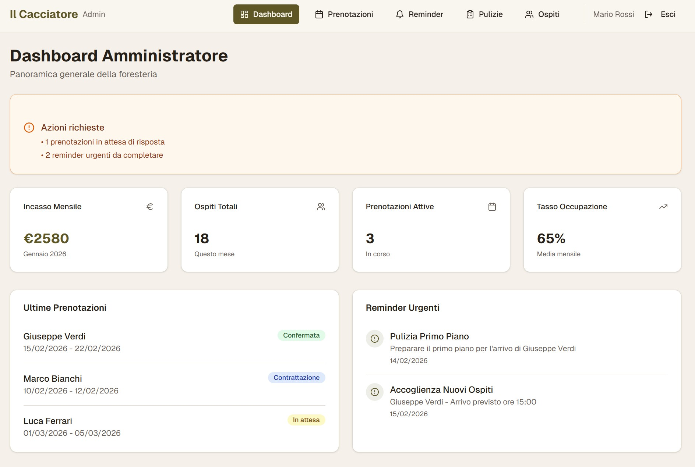
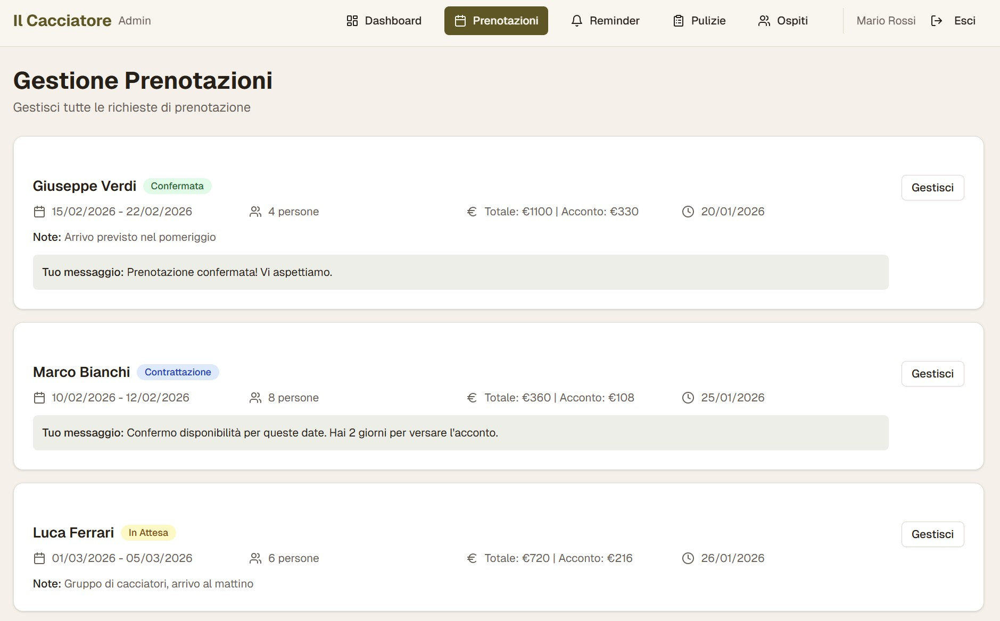
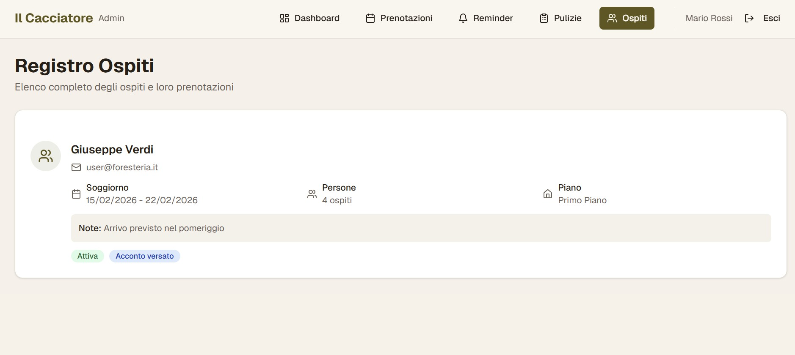
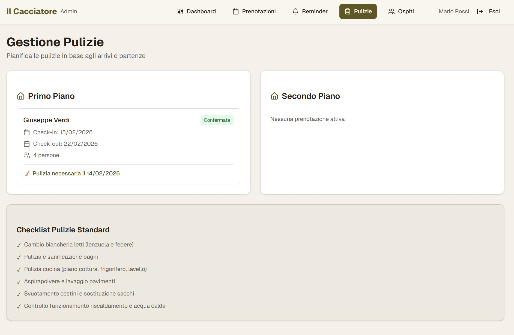
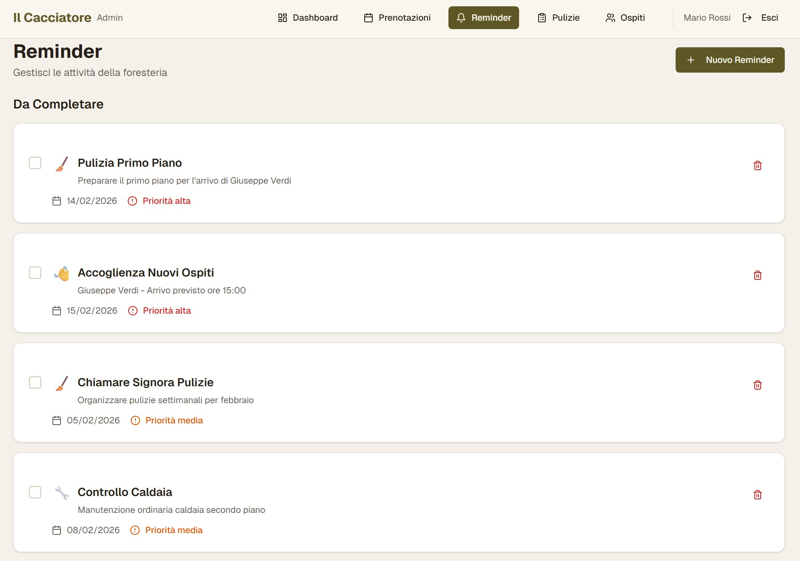
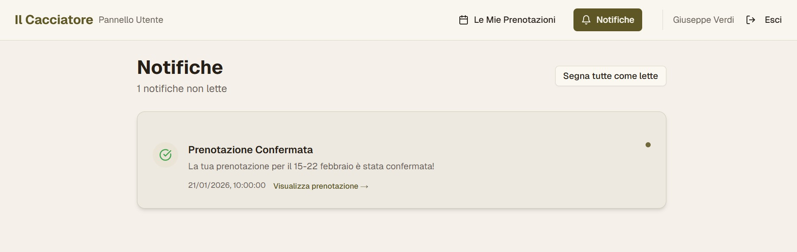
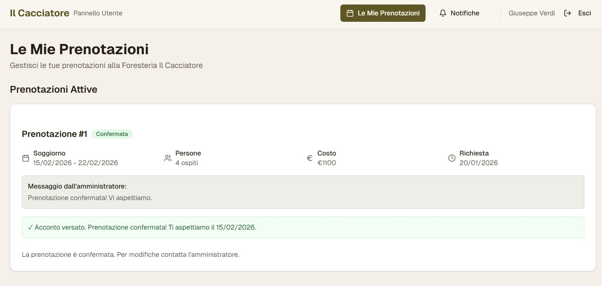

# 🏹 Foresteria - Il Cacciatore - Case Study

### 🌐 [Esplora la Demo Live](https://ilcacciatore.vercel.app/)

> **Nota di Trasparenza:** Questo progetto è un prototipo funzionale di facciata (Frontend-only). Il codice sorgente è mantenuto privato per proteggere la proprietà intellettuale.

### 🎯 Genesi ed Obiettivo del Progetto
Nato come esperimento pratico per supportare la gestione di un potenziale B&B di famiglia. L'obiettivo era diimostrare la potenza della **prototipazione rapida AI-driven**. Il Cacciatore è stato progettato per testare flussi di lavoro multi-tenant complessi e UX nel settore hospitality in tempi record.

### 🏗️ Architettura e Logica
- **Frontend Multi-tenant:** Implementazione di dashboard differenziate tramite routing dinamico.
- **AI-First Workflow:** Sviluppato utilizzando una pipeline di generazione assistita per iterare velocemente sul design.
- **Mocked Persistence:** Le logiche di backend sono attualmente simulate per validare l'esperienza utente prima dell'integrazione con il DB (Supabase/PostgreSQL).

### 🔑 Credenziali per la Demo
| Ruolo | Email | Password |
| :--- | :--- | :--- |
| **Admin** | admin@foresteria.it | demo123 |
| **User** | user@foresteria.it | demo123 |

### 📸 Visual Showcase & UX Flow

> **Nota:** Gli screenshot mostrano l'interfaccia ad alta fedeltà generata per validare i flussi di lavoro.

#### 🔐 Admin Experience: Pieno Controllo Operativo

**1. La Dashboard Centrale**
Un hub visivo per monitorare lo stato delle stanze, gli arrivi imminenti e le metriche chiave a colpo d'occhio.

  

---

**2. Gestione Prenotazioni (Calendario)**
Vista dettagliata del tabellone prenotazioni, ottimizzata per la manipolazione rapida delle assegnazioni stanze.

  

---

**3. Database Ospiti & Anagrafiche**
Archivio centralizzato per la gestione dei profili clienti e dello storico soggiorni.

  

---

**4. Coordinamento Pulizie & Manutenzione**
Modulo operativo per l'assegnazione dei task al personale del piano e il monitoraggio dello stato delle camere.

  

  

---

#### 👤 User Experience: Semplice e Intuitiva per l'Ospite

> **Focus Mobile-First:** L'interfaccia utente è stata progettata per garantire un'esperienza fluida e reattiva sui dispositivi mobile, il canale principale di interazione per gli ospiti.

**1. Area Notifiche & Stato Soggiorno**
Il punto di contatto principale per l'ospite, dove riceve aggiornamenti in tempo reale sul check-in, i servizi e le comunicazioni della Foresteria.

  

---

**2. Gestione Prenotazioni & Storico**
Un'interfaccia pulita e razionale che permette all'ospite di visualizzare i dettagli dei propri soggiorni passati e futuri.

  

